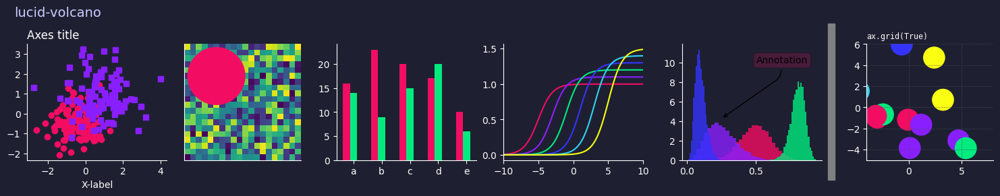

<div align="center">

A matplotlib theme based on [Lucid Volcano](https://github.com/Resmung0/Lucid-Volcano) vscode theme.

</div>


# Preview



# Instalation

First, you need to clone this repo:

```bash
git clone https://github.com/Resmung0/lucid-volcano-matplotlib.git
```

You need to have `matplotlib` installed in a virtual environment, than move the `lucid-volcano.mplstyle` file to the propper `stylelib` folder. You can run `installation.py` to do all of this automatically:

```bash
# Skip this if you already have a virtual environment
python -m venv .venv
source .venv/bin/activate

# Install the matplotlib theme
python installation.py
```

You can check if it worked by running the following command:

```python
import matplotlib.pyplot as plt
print('lucid-volcano' in plt.style.available)
```

For any more information, you can check the [matplotlib documentation](https://matplotlib.org/stable/users/explain/customizing.html#customizing-with-style-sheets).


# Usage

You could use it inside your code globally:

```python
import matplotlib.pyplot as plt

plt.style.use(“lucid-volcano”)
```

Or locally with a context manager:

```python
import matplotlib.pyplot as plt

with plt.style.context(“lucid-volcano"):
    ...
```
